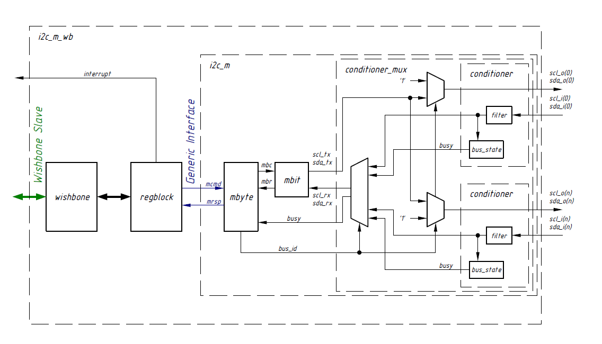

# Verification of I2CMB Master with Wishbone Interface

This repository documents the structure, verification flow, and insights from four interdependent SystemVerilog verification projects. The project is divided into four subsections.

## Project Overview
### Objective

Verify an I2C Master Bridge (I2CMB) module that communicates using a Wishbone-compliant bus interface.

### Verification Goals

- Ensure correct I2C protocol behavior (read/write/acknowledge handling).
- Validate Wishbone bus transactions for proper integration.
- Detect and address edge cases and protocol violations.
- Ensure both functional correctness and coverage closure using a layered testbench.

### I2CMB DUT Architecture
<p align="left">
  
  <br><em>Figure 1: I2CMB DUT Architecture</em>
</p>

where, **wb_if** is Wishbone interface, **i2c_if** is I2C slave model and **I2CMB** represents Master (DUT), serving as the bridge connecting both.
``` bash
module top;
  // Instantiate Wishbone and I2C interfaces
  wb_if wb_if_inst();
  i2c_if i2c_if_inst();

  // Connect DUT
  i2cmb i2cmb_inst (
    .wb_clk_i (wb_if_inst.clk),
    .wb_rst_i (wb_if_inst.rst),
    .scl      (i2c_if_inst.scl),
    .sda      (i2c_if_inst.sda)
  );
endmodule
```
### Testbench Architecture

- Driver: Generates Wishbone transactions.
- Monitor: Captures I2C signals.
- Scoreboard: Compares DUT output with expected results.
- Reset/Clock Generators.

### Testcase Development

- Basic Read/Write over Wishbone → I2C
- Error Injection Scenarios:
  - NACK Handling.
  - Invalid Address/Command Test.
- Stress Testing:
  - Multiple back-to-back transactions.
  - Long transaction sequences. 

### Sub Project 1: I2CMB Interface
Implementation of I2CMB master with a Wishbone interface, ensuring the master is connected to the slave and performing 32 writes and reads in increamenting order and 64 alternate reads and writes. 
- Structure implemented:

<p align="center">
  
</p>

- In i2c_if interface, the following modules were implemented:
   - Creation(to implement slave functionality),
   - Instantiation (to call instance of interface in 'top' file),
   - Verification (verify i2c_bus with the help of transcript from i2c_bus.monitor task).
  
- Important tasks implemented to model i2c slave are _Waits for and captures transfer start_, _provide data for read_ and _monitor_ the data received. 

### Sub Project 2: I2CMB Layered Test Bench

In this all the components of wishbone and slave agents along with environment were implemented. 
- wb_pkg for Wishbone agent (driver, monitor, configuration, transaction)
- i2c_pkg for I2C agent (driver, monitor, configuration, transaction)
- i2cmb_env_pkg containing: i2cmb_environment, i2cmb_test, i2cmb_generator, i2cmb_predictor, i2cmb_scoreboard, i2cmb_coverage.

Architecture:
<p align="center">

</p>

- Agent implementation:
``` bash
class wb_configuration extends ncsu_configuration;
  rand bit [31:0] base_addr;
endclass

class wb_agent extends ncsu_agent#(wb_transaction, wb_configuration);
  wb_driver driver;
  wb_monitor monitor;
endclass
```
Hence, each agent extends ncsu_agent, implementing UVM-like behavior.

The i2cmb environment components: generator, predictor and scoreboard are used in verification process. 
- The generator drives Wishbone transactions.
- The scoreboard checks DUT outputs with the predictions received from the predictor.

Challenges faced:
- Integrating base class libraries (ncsu_pkg) properly.
- Handling multiple bus transactions concurrently.
- Layered testbench dependencies during compilation.

### Sub Project 3: I2CMB Test Plan and Coverage

- Purpose:
  - Draft test plan which can help identify potential bugs in design.
  - Implement functional coverage covergroups, coverpoints, cross and assertions.
  - Making sure that coverage in testplan is perfectly linked to coverage in simulation.

- Test plan was in .xls format which was further imported in Questa, further converted to UCDB file and merged with simulation coverage.
  
- Challenges Faced:
  - Linking coverage points to test plan XML in Questa.
  - Ensuring coverage merges correctly into UCDB.

### Sub Project 4: Closing I2CMB Test Plan Coverage

- To make sure that coverage goals meet the functional goal, minor adjusments were made in bench, environment, wishbone and i2c files to accommodate test needs.
- A defined set of new directed testcases were added, targeting unhit coverage bins discovered from Project 3.
- Randomized tests were generated using different seed values to exercise unpredictable scenarios.

- A shell script named regress.sh that automatically:
  - Run all defined tests using specific seeds (listed in testlist file).
  - Merge UCDB files from individual tests.
  - Convert test plan XML into coverage UCDB format.
  - Merge simulation coverage UCDB and test plan UCDB.
  - Launch coverage viewer.

- Functional coverage achieved:
<p align="center">

</p>

For further details contact me on vchiluk3@gmail.com
